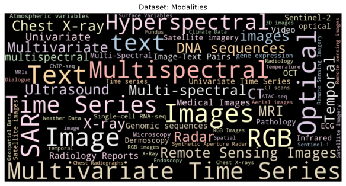
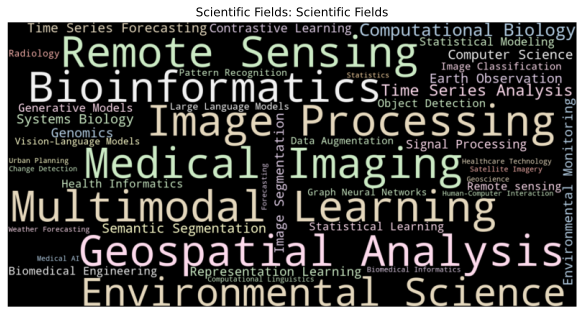
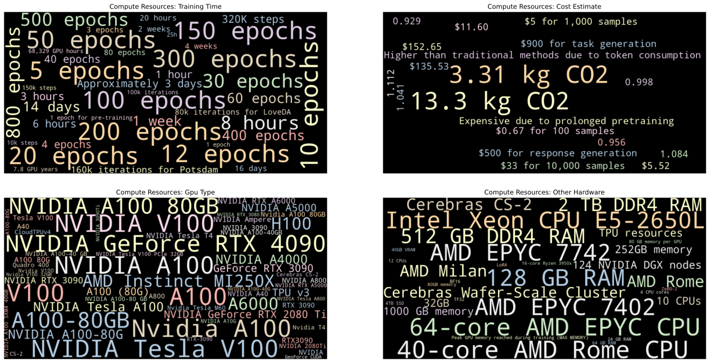
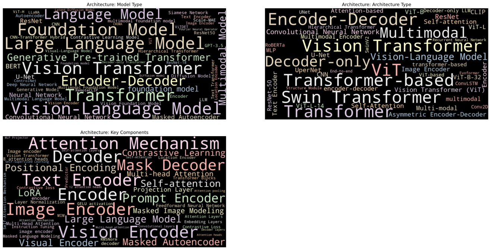

# Corema: Scientific Foundation Model Analysis

Corema (from Greek "Korema", meaning broom) is a project designed to "sweep" up and organize information about foundation models and large language models from research papers and associated resources. Like its namesake, it systematically gathers and tidies data, leveraging Large Language Models (LLMs) to intelligently extract and analyze information, creating a comprehensive knowledge base of model architectures, training methodologies, and technical specifications.

## How It Works

The pipeline operates through several key components:

1. **Data Collection**
   - Crawls academic papers from sources like arXiv, bioRxiv, and medRxiv
   - Downloads associated GitHub repositories
   - Crawls model documentation sites
   - Extracts metadata from all sources

2. **LLM-Powered Analysis**
   - Uses GPT-4 and other LLMs to:
     - Extract structured information from research papers
     - Generate standardized model summaries
     - Identify key technical specifications
     - Analyze training methodologies
     - Compare model architectures
   - Converts PDFs to machine-readable text
   - Creates visualizations of model characteristics

3. **Storage & Organization**
   - Maintains a structured local storage system
   - Tracks all artifacts through a global manifest
   - Preserves original PDFs and processed text
   - Stores LLM-extracted metadata in JSON format

## Getting Started

1. **Installation**
   ```bash
   # Clone the repository
   git clone <repository-url>
   cd corema

   # Create and activate conda environment
   conda env create -f environment.yml
   conda activate corema
   ```

2. **Basic Usage**
   ```bash
   # Run the collection pipeline
   python -m corema.cli collect projects.yaml 2>&1 | tee cli.log
   ```

## Results

Corema generates various visualizations to help understand trends and patterns in foundation model development:

### Model Evolution Timeline


A chronological visualization of foundation model releases, showing relevant scientific fields and estimated model size.

### Organizational Landscape


Visualization of organizations involved in foundation model development, showing the distribution across academic institutions, technology companies, research labs, and other entities. The heatmap reveals the intensity of involvement based on the number of published papers, highlighting key players in the field.

### Dataset Characteristics


Overview of common data sources, preprocessing techniques, and dataset characteristics used in model training.

### Scientific Fields


Analysis of the specific scientific domains and research areas where foundation models are being applied, excluding general ML/AI terminology to highlight the unique application domains.

### Preprocessing Pipeline


Comprehensive view of data preprocessing steps, including cleaning methods, transformation techniques, normalization approaches, and tokenization strategies used across different foundation models. This visualization reveals the common tools and systems used for preparing training data, showing the diversity of preprocessing pipelines in modern foundation model development.

### Training Infrastructure


Analysis of computational resources and infrastructure used for model training, highlighting the scale of compute required.

### Model Architecture


Word cloud visualization of common architectural patterns and components used across different foundation models.

### Training Details


Analysis of software frameworks, libraries, and tools commonly used in model training pipelines.

## New Sources

Here are some repos that could be useful for sourcing more papers retrospectively in the future:

- https://github.com/apeterswu/Awesome-Bio-Foundation-Models
- https://github.com/robotics-survey/Awesome-Robotics-Foundation-Models
- https://github.com/Jack-bo1220/Awesome-Remote-Sensing-Foundation-Models
- https://github.com/YutingHe-list/Awesome-Foundation-Models-for-Advancing-Healthcare
- https://github.com/Jianing-Qiu/Awesome-Healthcare-Foundation-Models
- https://github.com/OmicsML/awesome-foundation-model-single-cell-papers
- https://github.com/shengchaochen82/Awesome-Foundation-Models-for-Weather-and-Climate
- https://github.com/lishenghui/awesome-fm-fl
- https://github.com/xmindflow/Awesome-Foundation-Models-in-Medical-Imaging
- https://github.com/usail-hkust/Awesome-Urban-Foundation-Models
